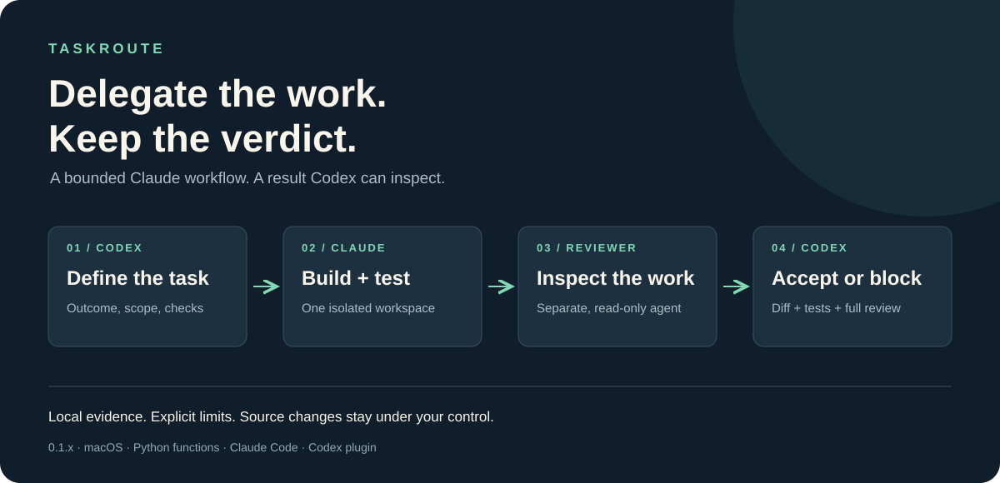
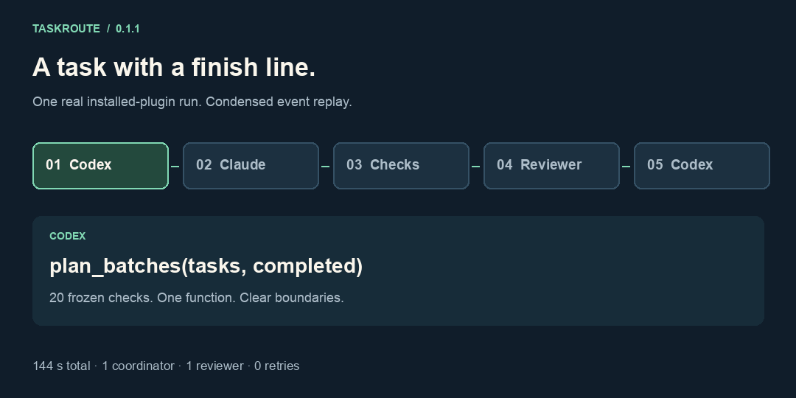

> **Version 0.3.1 — October 6, 2026.** Local historical metrics collection is
> included alongside native delivery and availability fallback. Collect counters
> and quota observations without a model call; accepted work and causal savings
> remain unknown. See [metrics collection](plugins/taskroute/docs/metrics.md).



# TaskRoute

**Let Claude handle a bounded coding task. Get back work Codex can verify.**

You and Codex agree on the outcome. Claude implements it, runs the tests, and
brings in a separate reviewer. Codex receives a compact verification receipt and handles any acceptance gaps.

TaskRoute is a local **Codex plugin** that keeps this handoff in one workflow.

## What you get

- **Working code** in a separate copy of your project.
- **Test results** checked against the agreed requirements.
- **An independent review** with the findings included.
- **A compact result:** Claude-verified work, checks, review findings and limitations.
- **A bounded correction path** when a concrete defect is found.
- **A local failure backlog** for later triage, without automatic fixes.

The released strict runner keeps original files unchanged until you apply the result.
The new local native-stage path works in the supplied project and requires a preserved
baseline; it is not an isolated copy.

<details>
<summary>See the flow in 13 seconds</summary>



A shortened replay of a real run's events, with timing compressed.
This is not a screen recording. [What we verified](VERIFICATION.md).

</details>

## Install with Codex

Copy this prompt into Codex:

```text
Install TaskRoute from https://github.com/heurema/taskroute using its Codex
marketplace. Follow INSTALL.md, preserve my existing setup, and verify the
installed version. Tell me when to open a new chat. Do not run a live task yet.
```

No manual cloning or terminal commands. Codex manages the downloaded plugin.

Already installed? Send:

```text
Update TaskRoute from https://github.com/heurema/taskroute following INSTALL.md.
Preserve my task results and other plugins. Verify the installed version and
report what changed. Do not run a live task yet.
```

Updates are requested explicitly; unattended updates are not promised.

## Give it a task

Once installed, ask Codex:

> Use TaskRoute for this repository task. Agree on the outcome, writable files and
> acceptance checks first, then delegate the implementation and review to Claude.
> Return a short verification receipt, important findings and a link to the changes.

See [everyday usage and the new 0.2.0 features](USAGE.md) for corrections, receipts
and the failure backlog.

The aim is to spend less Codex effort coordinating implementation and reviewing
logs. Overall benefit and savings have not been established; existing measurements
cover finite scenarios. [See the measurements](VERIFICATION.md).

**Version 0.2.2:** repository tasks use declared files and project checks, without
a language restriction. Requires macOS, Python 3.11+ and an existing Claude Code
setup. A finite live scenario passed; this is still an experimental workflow,
not a guarantee of correct code. [Supported scope and usage](plugins/taskroute/README.md).

[Installation guide for Codex](INSTALL.md) · [What's changed](CHANGELOG.md) ·
[Contributing](CONTRIBUTING.md) · [MIT license](LICENSE)
